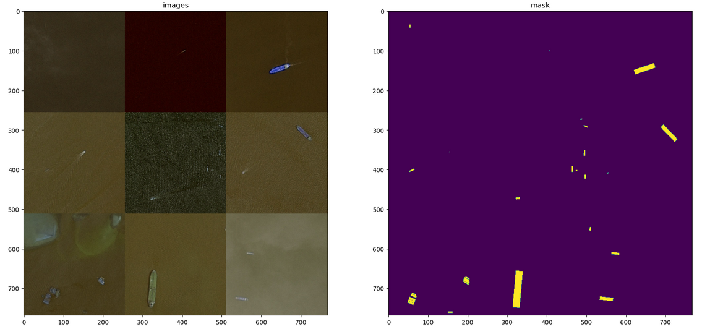
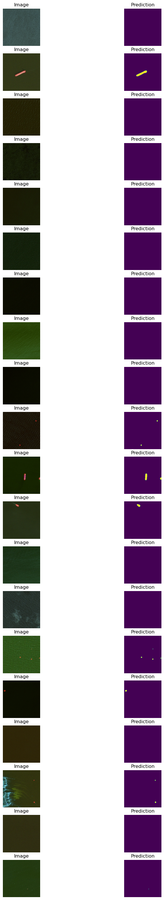

## Reading the data 
Our task is to train a neural network to detect a presence of ships on given image.
Into input we have train data with encoded pixels. If we have NA-value, it means
absence of ships on image. Otherwise, at least one ship has been detected. 
To write their place on image in train data have been used a encoded pixels(or rle-encoding).
In this encoding, each odd integer represents the start pixel and each even - difference of start and end pixel in same row

Before a decoding the rle into masks, we have to read a data, and after that group the images by name, because some pictures contains more
than one ship.
```
train_data = pd.read_csv('/kaggle/input/airbus-ship-detection/train_ship_segmentations_v2.csv')
train_data = train_data.groupby("ImageId")["EncodedPixels"].agg(EncodedPixels = lambda x: " ".join(map(str,  x)))
train_data.reset_index("ImageId", inplace = True)
train_data = train_data.to_numpy()
```
We can omit the images without any ship 'cause it wound't have any impact on ship's boundaries. 

## Decoding rle-pixels and making a mask
Let's split given string on separate integers
```
enc_pix = np.asarray(enc_pix.split(), dtype = np.uint32)
```
After that, we create two arrays: first will contains start pixels(i.e. odd elements), second - duration of row
```
num_of_pix = np.array(enc_pix[::2])
rep_of_pix = np.array(enc_pix[1::2])
```
The next step is creating a mask
First of all, our mask is matrix with height and widght are 768. 
```
        size = 768
```
Then we should concatenate all decoded pixels, because into output in previous step we obtained
arrays of separate ranges.
```
        rle = np.concatenate(arr_of_pix)

```
Substacting from all pixels 1 because of python indexing
```
        rle -= 1
```
Then we are creating the mask(on start one-dimesnional array due to flexibility of assigning) by assigning  decoded-pixels 255(what means white), and other pixels - zero(black) 
```
        plot_mask = np.zeros(square, dtype = np.uint8)
        plot_mask[rle] = 255
```
Reshaping the mask to matrix and normilizing it
```
        square = np.power(size, 2)
        plot_mask = np.reshape(plot_mask, (size, size)).T
        plot_mask = plot_mask / 255
        return plot_mask 
```

And decoding by creating a range for some number to number + corresponding difference. 

One of the possible solutions(and also a requirment) is U-net arcitecture. 


Using Python-generator due to large dataset


We want to know our prediction is accurate or not. For this we can use a DiCE score: 
It estimates a double ratio of intersection of predicted with truth pixel-values and sum of
all predicted and truth pixel-values. 
We will use keras.flatten function to make a 1-dimensional vector from tensor, and after that we 
rewrite formula as double point-wise product between two vectors divided by sum of their square-power(plus some epsiolon)

## Generators
One of the main problem we might face it's taking a horredous amount of RAM. 
To avoid this problem we have to use a python generator.
For implementation we should write a generator, what returns a image
But we can return a stacked images beacuse of higher performance of training

Creating the lists for image and their corresponding masks
```
    out_rgb = []
    out_mask = []
```
When for every name of image and mask in obtained tuple
```
for c_img_id, c_masks in tup:
```
Reading the image via opencv package
```
            rgb_path = os.path.join(train_image_dir, c_img_id)
            c_img = cv2.imread(rgb_path)
```
Expand the dimensiolity of mask by 1
```
        c_mask = np.expand_dims(decode_ep(c_masks), -1)
```
Reduct the shapes of image and mask by 3(it will slliglty affect on perfomance of training,
but sufficient on amount of taken RAM)
```
        c_img = c_img[::3, ::3]
        c_mask = c_mask[::3, ::3]
```
Adding the image and mask matrices in early created lists, and if some amount is not less than 
batch size then we generate lists and resetting them
```
            out_rgb += [c_img]
            out_mask += [c_mask]
            if len(out_rgb)>=batch_size:
                yield np.stack(out_rgb, 0)/255.0, np.stack(out_mask, 0)
                out_rgb, out_mask=[], []
```




And to avoid overfitting we can generate from given image a wide amount images.
So we can use from keras ImageDataGenerator class

First of all, setting parameters as a python dictionary
```
        dg_args = dict(featurewise_center = False, 
                  samplewise_center = False,
                  rotation_range = 45, 
                  width_shift_range = 0.1, 
                  height_shift_range = 0.1, 
                  shear_range = 0.01,
                  zoom_range = [0.9, 1.25],  
                  horizontal_flip = True, 
                  vertical_flip = True,
                  fill_mode = 'reflect',
                   data_format = 'channels_last')
```
Than initializing for images and masks IDG
```
        label_gen = IDG(**dg_args)
        
        image_gen = IDG(**dg_args)
```
And for stacked images and stacked masks 
```
        for in_x, in_y in in_gen:
```
applying IDGs  preliminarily set the random seed
```
        seed = np.random.choice(range(9999))
        
        g_x = image_gen.flow(255*in_x, 
                             batch_size = in_x.shape[0], 
                             seed = seed, 
                             shuffle=True)
        g_y = image_gen.flow(in_y, 
                             batch_size = in_x.shape[0], 
                             seed = seed, 
                             shuffle=True)

        yield next(g_x)/255.0, next(g_y)
```

## DICE-score
To estimate an accuracy of mask prediction we should use DICE score(and consequenlty DICE score lsss)
We obtain predicted mask and true mask, and some small postive real number epsilon, to avoid case 0/0 
First of all, we should flatten it from n-dimensonal tensor to 1-dimensonal array
```
y_true,y_pred  =K.flatten(y_true), K.flatten(y_pred)
```
To compute an intersection between them we can multiply one vector to another
If some number are false, than it would be multiplied by zero, so we obtained intersetcion
```
intersection=K.sum(y_true* y_pred)
```
To compute union we should compute sum of raised in power two predicted vector and true vector
That's because in case 100% accuracy

$a: y_{pred}, b: y_{true}$

$a = b: \frac{2*|ab| + \epsilon }{|a^2| + |b^2| + \epsilon } = \frac{2*|a^2| + \epsilon }{2*|a^2| + epsilon} = 1 $
```
union  = K.sum(y_true*y_true) + K.sum(y_pred*y_pred)
```
And retrun DICE_score
```
        return(2* intersection + eps) / (union + eps)
```

And to compute DICE scorr loss we just need to substract from 1 DICE score
```
        return 1-DICE_score(y_true, y_pred)
```


## U-net arcitecture

)

Resolution of all images is 768x786.  786 can be divided by 32, so we can use a special case(or better to say the improvment) of U-net with saving shape and number of output filters increasing(or decreasing) by two on each level 

### Down-scaling
```
>     conv_i = layers.Conv2D(8*2^i, (3, 3), activation="relu", padding = 'same')(input_layer)
>     conv_i = layers.Conv2D(8*2^i, (3, 3), activation="relu", padding = 'same')(conv_i)
>     pool_i = layers.MaxPooling2D((2, 2))(conv_i)
>     pool_i = layers.Dropout(0.5)(ool_i)
```
### Middle level
```
>   convm = layers.Conv2D(128, (3, 3), activation="relu", padding = 'same')(pool4)
>   convm = layers.Conv2D(128, (3, 3), activation="relu", padding = 'same')(convm) 
```    
### Up-scaling
```
>      deconv_i = layers.Conv2DTranspose(8*2^(4-i), (3, 3), strides=(2, 2), padding = 'same')(uconv_i)
>      uconv_i = layers.concatenate([deconv_i, conv_i])
>      uconv_i = layers.Dropout(0.5)(uconv_i)
>      uconv_i = layers.Conv2D(8*2^(4-i), (3, 3), activation="relu", padding = 'same')(uconv_i)
>      uconv_i = layers.Conv2D(8*2^(4-i), (3, 3), activation="relu", padding = 'same')(uconv_i)
```
of layer during convolution.
Also in model I used a Dropout layer for better prediction perfomance

## Compiling model and predicting 
First of all, for compiling model wewill use a ADAM(stochastic gradient descent method) otimizer, for loss - DICE score loss, and for accuracy metrics - binary accuracy and DICE score
```
from keras.optimizers import Adam

#Compiling the model
model.compile(optimizer=Adam(1e-3, decay=1e-6), loss=DICE_score_loss, metrics=["binary_accuracy", DICE_score])
```
Empirically, on the best batch size of train images is 16(4x4), epochs - 8, steps per epochs - 20. 
We will use a fit_generator method(a varient of fit-method), what using large data amount case, and
validation data to see the accuracy on the untrained data 
```
gen = create_aug_gen(train_gererator(train_data, 16))
model.fit_generator(gen, steps_per_epoch=20,
                    epochs = 8, validation_data=(valid_x, valid_y))
```
**
Epoch 1/8
20/20 [==============================] - 88s 4s/step - loss: 0.9818 - binary_accuracy: 0.9568 - DICE_score: 0.0182 - val_loss: 0.9771 - val_binary_accuracy: 0.9953 - val_DICE_score: 0.0229 - lr: 0.0010
Epoch 2/8
20/20 [==============================] - 86s 4s/step - loss: 0.9443 - binary_accuracy: 0.9927 - DICE_score: 0.0557 - val_loss: 0.8907 - val_binary_accuracy: 0.9952 - val_DICE_score: 0.1095 - lr: 0.0010
Epoch 3/8
20/20 [==============================] - 87s 4s/step - loss: 0.8807 - binary_accuracy: 0.9928 - DICE_score: 0.1193 - val_loss: 0.8162 - val_binary_accuracy: 0.9951 - val_DICE_score: 0.1831 - lr: 0.0010
Epoch 4/8
20/20 [==============================] - 86s 4s/step - loss: 0.7591 - binary_accuracy: 0.9930 - DICE_score: 0.2409 - val_loss: 0.5834 - val_binary_accuracy: 0.9938 - val_DICE_score: 0.4155 - lr: 0.0010
Epoch 5/8
20/20 [==============================] - 84s 4s/step - loss: 0.6318 - binary_accuracy: 0.9901 - DICE_score: 0.3682 - val_loss: 0.5825 - val_binary_accuracy: 0.9909 - val_DICE_score: 0.4170 - lr: 0.0010
Epoch 6/8
20/20 [==============================] - 89s 4s/step - loss: 0.5506 - binary_accuracy: 0.9920 - DICE_score: 0.4494 - val_loss: 0.4326 - val_binary_accuracy: 0.9957 - val_DICE_score: 0.5669 - lr: 0.0010
Epoch 7/8
20/20 [==============================] - 84s 4s/step - loss: 0.5499 - binary_accuracy: 0.9933 - DICE_score: 0.4501 - val_loss: 0.4264 - val_binary_accuracy: 0.9955 - val_DICE_score: 0.5725 - lr: 0.0010
Epoch 8/8
20/20 [==============================] - 84s 4s/step - loss: 0.5748 - binary_accuracy: 0.9940 - DICE_score: 0.4252 - val_loss: 0.4449 - val_binary_accuracy: 0.9957 - val_DICE_score: 0.5531 - lr: 0.0010
**
Real DICE score is 55 percent, which means our model deals with images pretty good
```
pred = model.predict(first_img)
```



